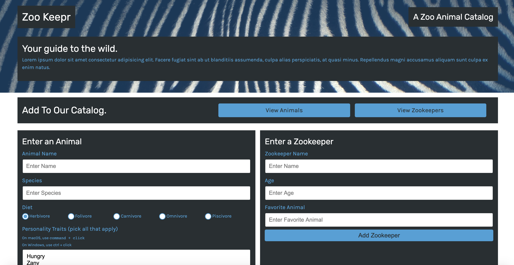

# Zookeeper

## Description 
This project is an application that uses Node.js and Express.js. This projects uses HTTP requests to receive and displayed JSON data. This application is deployed on Heroku for viewing. 

## Table of Contents
* [Installation](#installation)
* [Usage](#usage)
* [License](#license)
* [Contributing](#contributing)
* [Tests](#tests)
* [Questions](#questions)

## Installation 
The user should clone the repository from GitHub. This application requires Node.js and Express.js. To download, please run npm install node and express. To start server, run npm start.

## Usage 
This application will allow users to view, add, and search animals or zookeepers. 
Please view deployed live Heroku [URL](https://zookeeper-tracker.herokuapp.com/zookeepers) 

## License 
This project is license under MIT

## Contributing 
Contributors should read the installation section. 

## Tests
This application uses Jest. Please install Jest by running npm install jest. 

## Questions
If you have any questions about this projects, please contact me directly at nicole.elisaw@gmail.com. You can view more of my projects at https://github.com/nicolewallace09.